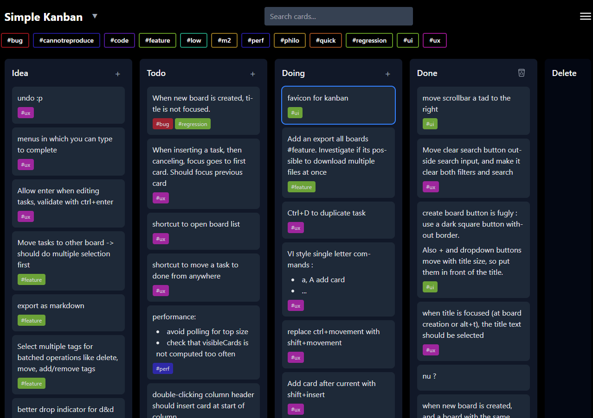

# Vue 3 Kanban Board

A power-user friendly keyboard-driven Kanban board application built with Vue
3, TypeScript, and Tailwind CSS.




## Features

- **Keyboard Navigation**: press ctrl+H to learn mode
- **Multi-board Support**
- **Drag & Drop**
- **Tag System**: dynamic tags from task content
- **Advanced Filtering**
- **Data Persistence**: using indexedDB
- **Import/Export**: to JSON files
- **Markdown Support**: Basic markdown rendering in card content

## Not obvious

- Press '#' followed by a tag to find it quickly. Use arrows when multiple tags match.
- Enter #tag in your task content to automatically create a tag. Tags will show under the content. If a line contains only tags, it will not be shown in the content.
- Use simple markdown in your tasks.

## Installation

1. Install dependencies:
```bash
npm install
```

2. Start development server:
```bash
npm run dev
```

3. Build for production:
```bash
npm run build
```

## Browser Support

- Modern browsers with ES2020 support
- IndexedDB support required for persistence
- CSS Grid and Flexbox support required

## Note

This project was done as an experimentation to use LLMS based code generation
tools, and trying to achieve readable maintainable code. To make the
experimentation relevant, the goal was to create an application that I would
use daily.


## License

This project is licensed under the Apache License 2.0.

Attribution requirement:
If this project is used in a product (commercial or non-commercial), the documentation, about section, or credits must include the following notice:

"This product uses Kanban by Martijn van der Kwast (https://github.com/mvdkwast/kanban])"
